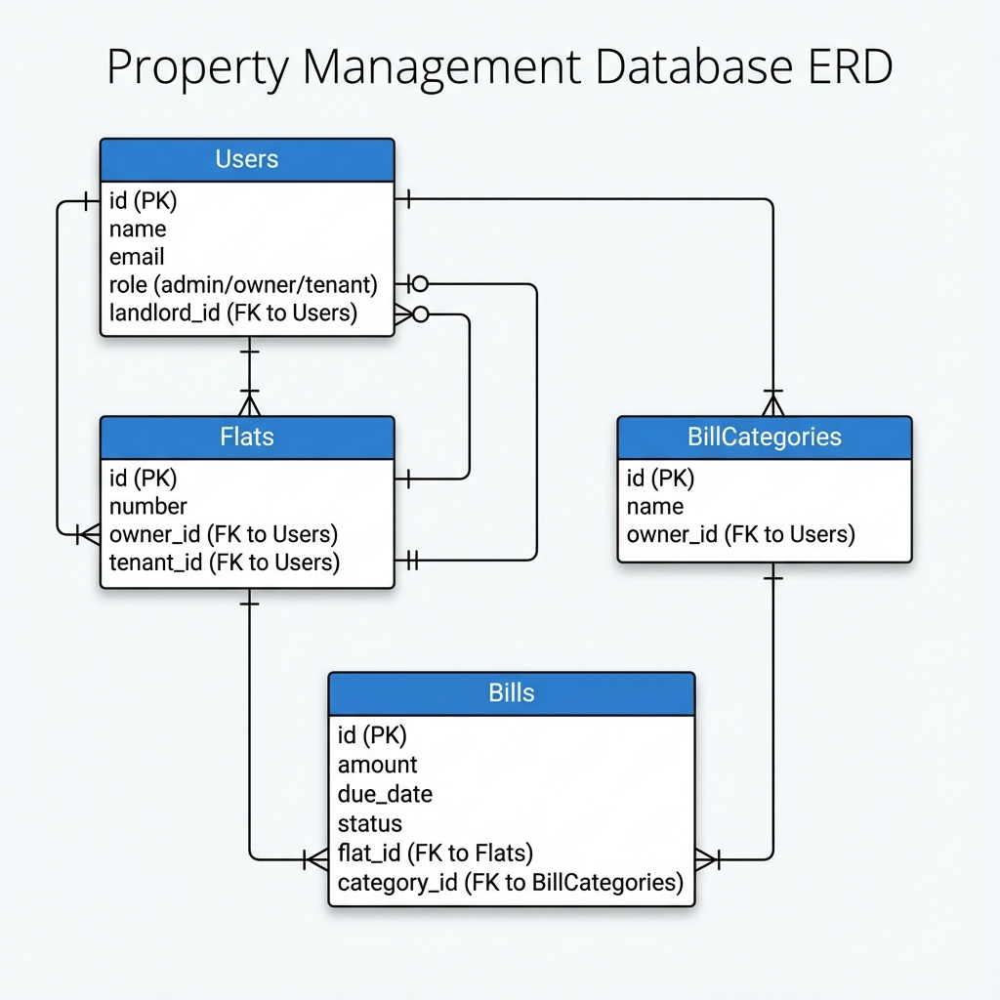

# Building Management System

A multi-tenant building management system allowing House Owners to manage their flats, tenants, and bills, with Admin oversight.

## Setup Instructions

### Prerequisites
- Docker & Docker Compose
- Node.js & NPM (for local frontend dev, optional if using Docker)
- PHP & Composer (for local backend dev, optional if using Docker)

### Installation
1. **Clone the repository:**
   ```bash
   git clone <repository_url>
   cd building-management-system
   ```

2. **Start the application using Docker:**
   ```bash
   docker-compose up -d --build
   ```

3. **Install Backend Dependencies & Setup Database:**
   ```bash
   docker-compose exec backend composer install
   docker-compose exec backend php artisan key:generate
   docker-compose exec backend php artisan migrate --seed
   docker-compose exec backend php artisan jwt:secret
   ```

4. **Access the Application:**
   - **Frontend:** [http://localhost:5173](http://localhost:5173) (or configured port)
   - **Backend API:** [http://localhost:8000](http://localhost:8000)

### Default Credentials (after seeding)
- **Admin:** `admin@example.com` / `password`
- **Owner:** `owner@example.com` / `password`
- **Tenant:** `tenant@example.com` / `password`

## PRD and Technical Documentation

### Overview
The system facilitates the management of rental properties by connecting Admins, Owners, and Tenants.

### Tech Stack
- **Backend:** Laravel 11 (PHP 8.2), MySQL
- **Frontend:** React 18, Vite
- **Infrastructure:** Docker, Nginx

### Core Features
- **Authentication:** JWT-based stateless authentication.
- **Roles:**
    - **Admin:** System oversight, User management (Edit Owners/Tenants/Landlord assignment).
    - **Owner:** Manage Flats, Tenants, Bill Categories, and Bills.
    - **Tenant:** View assigned Bills.
- **Tenancy:** Logic enforced via `landlord_id` linking Tenants to Owners.

## Scaling Notes (1M Users)

To scale this system to handle 1 million active users, we would implement the following strategies:

### 1. Database Optimization & Architecture
- **Read/Write Splitting:** Implement Master-Slave replication. Writes go to the Master, while Reads are distributed across multiple Read Replicas to handle high query volume.
- **Sharding:** Partition the database horizontally based on `landlord_id` or `building_id`. This isolates tenant data and effectively distributes load across multiple database shards.
- **Indexing:** Ensure strict indexing on high-cardinality columns used in filtering (`role`, `landlord_id`, `email`, `status`).

### 2. Caching Strategy
- **Redis Layer:** Implement Redis to cache frequent, read-heavy data such as User Profiles, Bill Categories, and configurations.
- **Query Caching:** Cache complex aggregation results (e.g., dashboard stats) with short TTLs.

### 3. Backend Scalability
- **Horizontal Scaling:** Run the Laravel application (PHP-FPM) in stateless containers. Use a Load Balancer (e.g., Nginx, AWS ALB) to distribute incoming traffic across the fleet of containers.
- **Asynchronous Processing:** Offload heavy tasks (e.g., Bill Generation emails, Report generation) to a Queue system (RabbitMQ or Redis) to ensure the API remains responsive.

### 4. Infrastructure & Frontend
- **CDN:** Serve all static frontend assets (JS, CSS, Images) via a CDN (Cloudflare or AWS CloudFront) to reduce server load and latency.
- **Container Orchestration:** Usage of Kubernetes (K8s) to manage auto-scaling of backend services based on CPU/Memory usage.

## Database Schema Diagram


